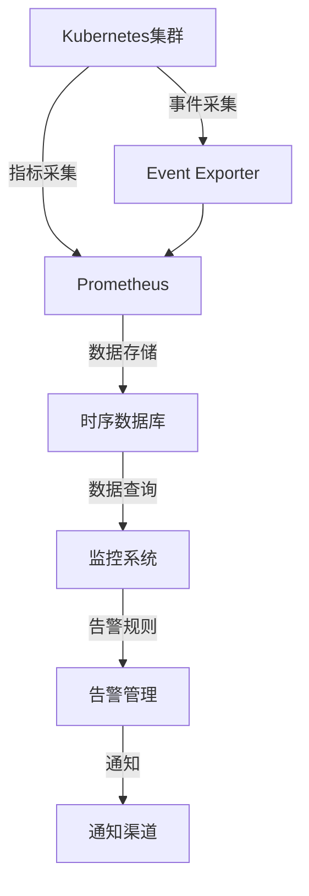
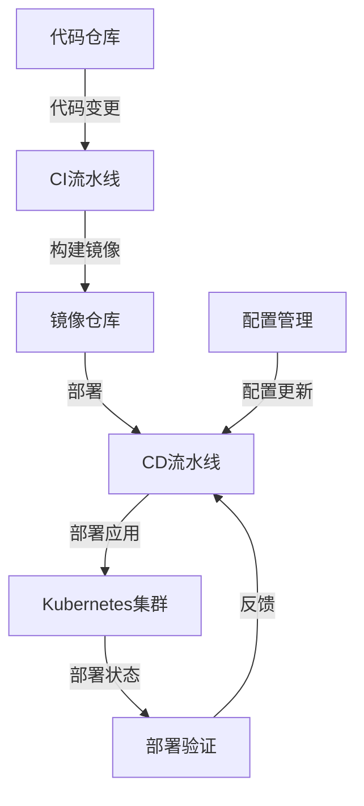
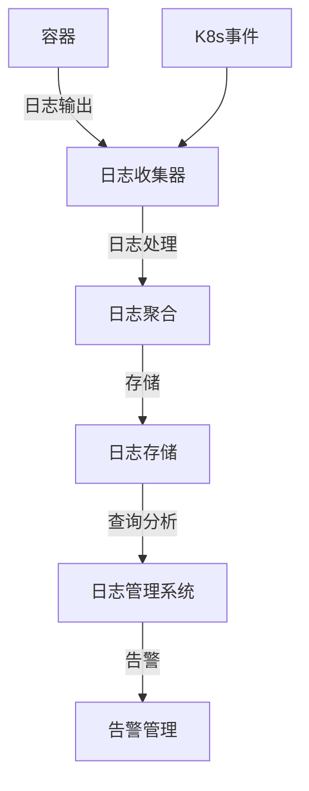
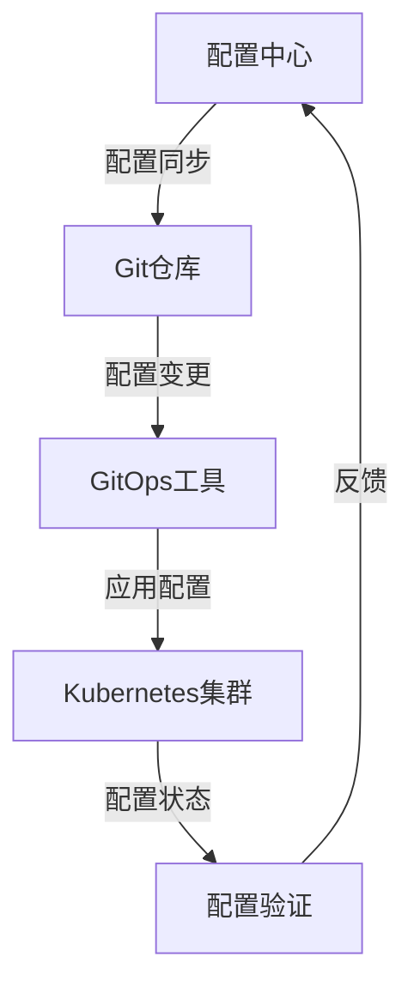
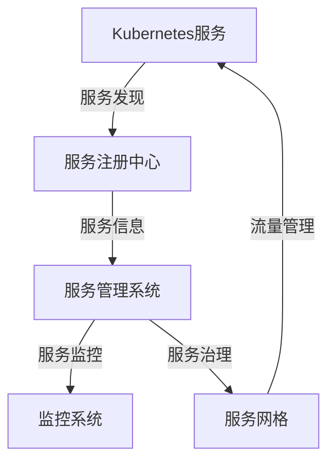
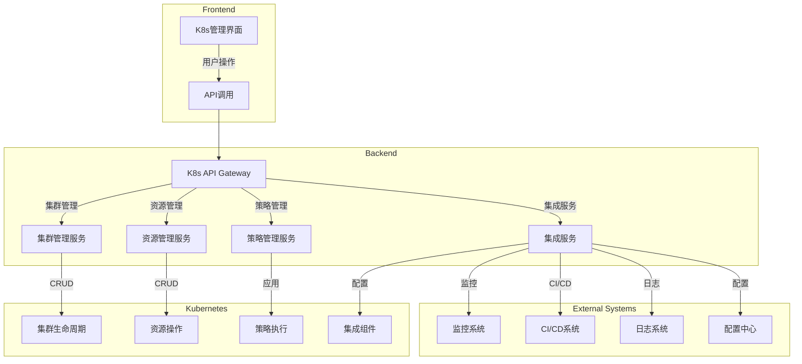
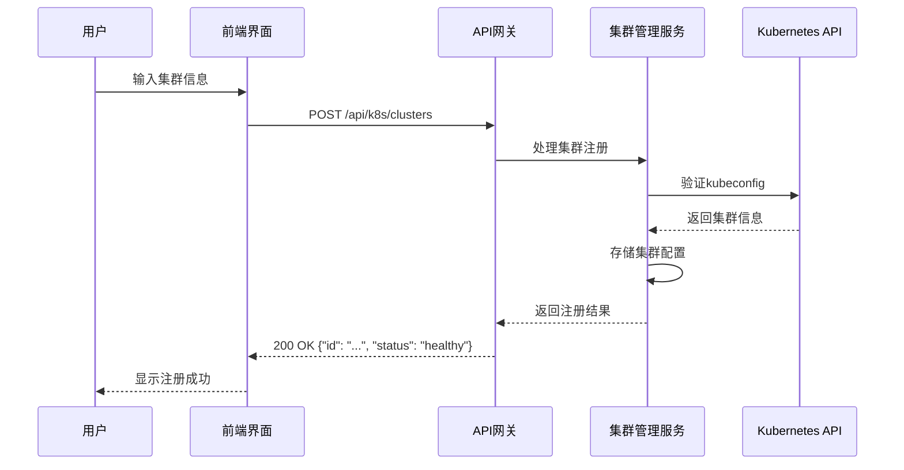
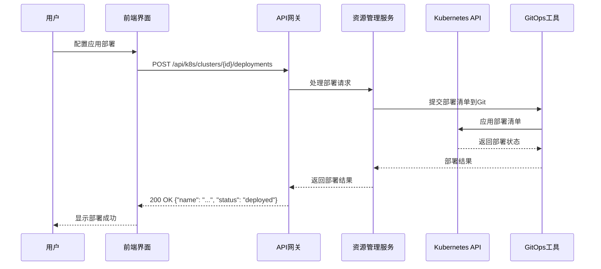

# Kubernetes 集群功能模块与集成方案

## 1. 概述

本文档定义了Kubernetes集群功能模块的设计方案及其与现有系统的集成策略。基于当前平台已有的K8s基础管理功能，本方案旨在增强Kubernetes集群的管理能力，实现与平台其他功能模块的深度集成，构建完整的DevOps平台生态系统。

## 2. 核心功能需求

### 2.1 集群生命周期管理

| 功能 | 描述 | 优先级 |
|------|------|--------|
| 集群注册 | 支持注册现有K8s集群，通过kubeconfig或服务账户认证 | 高 |
| 集群创建 | 支持通过云提供商API自动创建K8s集群 | 中 |
| 集群升级 | 支持Kubernetes版本升级管理 | 中 |
| 集群删除 | 支持安全删除集群，包括资源清理 | 中 |
| 集群健康检查 | 定期检查集群健康状态，包括API服务器、etcd等组件 | 高 |

### 2.2 高级资源管理

| 功能 | 描述 | 优先级 |
|------|------|--------|
| 命名空间管理 | 支持创建、删除、配置命名空间 | 高 |
| Deployment管理 | 支持创建、更新、回滚Deployment | 高 |
| StatefulSet管理 | 支持有状态应用的管理 | 中 |
| DaemonSet管理 | 支持守护进程管理 | 中 |
| Job/CronJob管理 | 支持一次性任务和定时任务管理 | 中 |
| ConfigMap/Secret管理 | 支持配置和密钥管理 | 高 |
| Service/Ingress管理 | 支持服务暴露和路由管理 | 高 |

### 2.3 自动扩缩容

| 功能 | 描述 | 优先级 |
|------|------|--------|
| HPA支持 | 基于CPU/内存使用率的水平自动扩缩容 | 高 |
| VPA支持 | 垂直Pod自动扩缩容，自动调整资源请求和限制 | 中 |
| Cluster Autoscaler | 基于集群负载自动扩缩节点数量 | 中 |

### 2.4 网络策略管理

| 功能 | 描述 | 优先级 |
|------|------|--------|
| NetworkPolicy管理 | 支持创建和管理网络策略，控制Pod间通信 | 中 |
| 网络插件集成 | 支持主流网络插件（Calico、Cilium等）的配置 | 中 |

### 2.5 存储管理

| 功能 | 描述 | 优先级 |
|------|------|--------|
| PVC管理 | 支持持久卷声明管理 | 高 |
| StorageClass管理 | 支持存储类配置 | 中 |
| 云存储集成 | 支持AWS EBS、GCP PD、Azure Disk等云存储 | 中 |

### 2.6 安全管理

| 功能 | 描述 | 优先级 |
|------|------|--------|
| RBAC管理 | 支持基于角色的访问控制 | 高 |
| Pod Security Policy | 支持Pod安全策略配置 | 中 |
| 镜像安全扫描 | 集成镜像安全扫描功能 | 中 |
| 网络安全 | 支持网络策略和服务网格安全功能 | 中 |

### 2.7 多集群管理

| 功能 | 描述 | 优先级 |
|------|------|--------|
| 集群分组 | 支持按环境、区域等维度对集群进行分组 | 高 |
| 跨集群操作 | 支持在多个集群上执行批量操作 | 中 |
| 集群联邦 | 支持Kubernetes集群联邦，实现跨集群服务发现 | 低 |

### 2.8 GitOps集成

| 功能 | 描述 | 优先级 |
|------|------|--------|
| Flux/Argo CD集成 | 集成GitOps工具，实现基于Git的应用部署 | 高 |
| 配置漂移检测 | 检测集群配置与Git仓库的差异 | 中 |
| 自动同步 | 支持自动将Git变更同步到集群 | 中 |

## 3. 与现有系统的集成方案

### 3.1 监控系统集成

#### 3.1.1 集成目标

将Kubernetes集群的监控数据集成到现有监控系统，实现统一的监控视图和告警管理。

#### 3.1.2 集成架构

#### 3.1.3 数据交互流程

1. **指标采集**：
   - 在K8s集群中部署Prometheus和Node Exporter
   - 采集集群组件指标（kube-apiserver、kube-controller-manager、kube-scheduler、etcd）
   - 采集节点指标（CPU、内存、磁盘、网络）
   - 采集Pod/容器指标（资源使用率、网络流量）

2. **事件采集**：
   - 部署Kubernetes Event Exporter
   - 采集集群事件（Pod创建/删除、节点状态变化等）

3. **数据存储**：
   - 将指标数据存储到时序数据库
   - 支持数据压缩和 retention 策略

4. **数据查询与展示**：
   - 集成现有监控系统的查询API
   - 提供K8s专用监控仪表盘

5. **告警管理**：
   - 定义K8s专用告警规则（集群不可用、节点故障、Pod崩溃等）
   - 集成现有告警管理系统

#### 3.1.4 具体集成点

| 集成点 | 实现方式 | 数据流向 |
|--------|----------|----------|
| 集群健康监控 | 部署健康检查组件 | K8s API → 监控系统 |
| 节点资源监控 | 部署Node Exporter | 节点 → Prometheus → 监控系统 |
| Pod/容器监控 | 使用cAdvisor | 容器 → Prometheus → 监控系统 |
| 应用监控 | 支持自定义指标 | 应用 → Prometheus → 监控系统 |
| 告警集成 | 配置告警规则 | 监控系统 → 告警管理 |

### 3.2 CI/CD流水线集成

#### 3.2.1 集成目标

实现Kubernetes集群与CI/CD流水线的无缝集成，支持应用的自动化构建、测试和部署。

#### 3.2.2 集成架构

#### 3.2.3 数据交互流程

1. **代码变更触发**：
   - 代码提交/PR触发CI流水线
   - 构建应用镜像并推送到镜像仓库

2. **部署流程**：
   - CD流水线拉取最新镜像
   - 生成Kubernetes部署清单
   - 应用部署到K8s集群

3. **部署验证**：
   - 监控应用启动状态
   - 执行健康检查
   - 验证服务可用性

4. **回滚机制**：
   - 部署失败时自动回滚到之前版本
   - 支持手动回滚操作

5. **环境管理**：
   - 支持多环境部署（开发、测试、生产）
   - 环境间配置隔离

#### 3.2.4 具体集成点

| 集成点 | 实现方式 | 数据流向 |
|--------|----------|----------|
| 镜像构建 | 集成Docker构建 | 代码 → 镜像仓库 |
| 部署清单生成 | 使用Helm/Manifests | CD系统 → K8s API |
| 部署执行 | 使用kubectl或API | CD系统 → K8s集群 |
| 部署验证 | 健康检查和监控 | K8s集群 → CD系统 |
| 环境配置 | 集成配置中心 | 配置中心 → CD系统 → K8s集群 |

### 3.3 日志管理集成

#### 3.3.1 集成目标

将Kubernetes集群的容器日志集成到现有日志管理系统，实现统一的日志收集、存储和分析。

#### 3.3.2 集成架构

#### 3.3.3 数据交互流程

1. **日志收集**：
   - 在每个节点部署日志收集器（如Fluentd、Logstash）
   - 收集容器标准输出日志
   - 收集Kubernetes事件

2. **日志处理**：
   - 解析日志格式
   - 添加元数据（Pod名称、命名空间、容器名称等）
   - 日志过滤和转换

3. **日志存储**：
   - 存储到集中式日志存储系统
   - 支持日志索引和检索

4. **日志分析**：
   - 提供日志查询和分析功能
   - 支持日志可视化
   - 支持日志告警

#### 3.3.4 具体集成点

| 集成点 | 实现方式 | 数据流向 |
|--------|----------|----------|
| 容器日志收集 | 部署DaemonSet日志收集器 | 容器 → 日志收集器 → 日志系统 |
| 应用日志收集 | 支持文件日志和标准输出 | 应用 → 日志收集器 → 日志系统 |
| 集群组件日志 | 收集K8s组件日志 | 组件 → 日志收集器 → 日志系统 |
| 日志查询 | 集成日志查询API | 日志系统 → 前端界面 |
| 日志告警 | 配置日志告警规则 | 日志系统 → 告警管理 |

### 3.4 配置中心集成

#### 3.4.1 集成目标

将Kubernetes集群的配置管理与现有配置中心集成，实现配置的统一管理和版本控制。

#### 3.4.2 集成架构

#### 3.4.3 数据交互流程

1. **配置管理**：
   - 在配置中心管理应用配置
   - 配置版本控制和变更历史

2. **配置同步**：
   - 将配置同步到Git仓库
   - 支持配置模板和环境变量替换

3. **配置应用**：
   - GitOps工具监控Git仓库变更
   - 自动将配置应用到K8s集群
   - 生成ConfigMap和Secret资源

4. **配置验证**：
   - 验证配置应用状态
   - 检测配置漂移

#### 3.4.4 具体集成点

| 集成点 | 实现方式 | 数据流向 |
|--------|----------|----------|
| 配置同步 | Webhook或定时同步 | 配置中心 → Git仓库 |
| 配置生成 | 模板渲染 | Git仓库 → K8s资源 |
| 配置应用 | GitOps工具 | Git仓库 → K8s集群 |
| 配置验证 | 状态检查 | K8s集群 → 配置中心 |
| 配置回滚 | Git版本控制 | Git仓库 → K8s集群 |

### 3.5 服务管理集成

#### 3.5.1 集成目标

将Kubernetes集群中的服务与现有服务管理系统集成，实现服务的统一发现、监控和治理。

#### 3.5.2 集成架构

#### 3.5.3 数据交互流程

1. **服务注册**：
   - K8s服务自动注册到服务注册中心
   - 包含服务名称、端口、健康状态等信息

2. **服务发现**：
   - 服务管理系统从注册中心获取服务信息
   - 构建服务依赖关系图

3. **服务监控**：
   - 监控服务健康状态
   - 追踪服务调用指标

4. **服务治理**：
   - 集成服务网格实现流量管理
   - 支持服务路由、负载均衡、熔断等功能

#### 3.5.4 具体集成点

| 集成点 | 实现方式 | 数据流向 |
|--------|----------|----------|
| 服务注册 | 服务发现适配器 | K8s API → 服务注册中心 |
| 服务发现 | 服务目录 | 服务注册中心 → 服务管理系统 |
| 服务监控 | 集成监控指标 | K8s服务 → 监控系统 |
| 服务治理 | 服务网格集成 | 服务管理系统 → 服务网格 |
| 服务安全 | mTLS配置 | 服务网格 → K8s服务 |

## 4. 功能规格说明书

### 4.1 模块架构图

### 4.2 API接口定义

#### 4.2.1 集群管理API

| API路径 | 方法 | 功能 | 请求体 | 响应体 |
|---------|------|------|--------|--------|
| `/api/k8s/clusters` | GET | 获取集群列表 | N/A | `{"clusters": [{"id": "...", "name": "...", "status": "..."}]}` |
| `/api/k8s/clusters` | POST | 注册/创建集群 | `{"name": "...", "kubeconfig": "..."}` | `{"id": "...", "name": "...", "status": "..."}` |
| `/api/k8s/clusters/{id}` | GET | 获取集群详情 | N/A | `{"id": "...", "name": "...", "version": "...", "nodes": [...]}` |
| `/api/k8s/clusters/{id}` | PUT | 更新集群配置 | `{"name": "...", "kubeconfig": "..."}` | `{"id": "...", "name": "...", "status": "..."}` |
| `/api/k8s/clusters/{id}` | DELETE | 删除集群 | N/A | `{"success": true}` |
| `/api/k8s/clusters/{id}/health` | GET | 集群健康检查 | N/A | `{"status": "healthy", "components": [...]}` |

#### 4.2.2 资源管理API

| API路径 | 方法 | 功能 | 请求体 | 响应体 |
|---------|------|------|--------|--------|
| `/api/k8s/clusters/{id}/namespaces` | GET | 获取命名空间列表 | N/A | `{"namespaces": [{"name": "...", "status": "..."}]}` |
| `/api/k8s/clusters/{id}/namespaces` | POST | 创建命名空间 | `{"name": "...", "labels": {...}}` | `{"name": "...", "status": "..."}` |
| `/api/k8s/clusters/{id}/namespaces/{name}` | DELETE | 删除命名空间 | N/A | `{"success": true}` |
| `/api/k8s/clusters/{id}/deployments` | GET | 获取Deployment列表 | N/A | `{"deployments": [{"name": "...", "namespace": "...", "replicas": 3}]}` |
| `/api/k8s/clusters/{id}/deployments` | POST | 创建Deployment | `{"name": "...", "namespace": "...", "spec": {...}}` | `{"name": "...", "status": "..."}` |
| `/api/k8s/clusters/{id}/deployments/{namespace}/{name}` | PUT | 更新Deployment | `{"spec": {...}}` | `{"name": "...", "status": "..."}` |
| `/api/k8s/clusters/{id}/deployments/{namespace}/{name}` | DELETE | 删除Deployment | N/A | `{"success": true}` |
| `/api/k8s/clusters/{id}/deployments/{namespace}/{name}/rollback` | POST | 回滚Deployment | `{"revision": 1}` | `{"success": true}` |

#### 4.2.3 策略管理API

| API路径 | 方法 | 功能 | 请求体 | 响应体 |
|---------|------|------|--------|--------|
| `/api/k8s/clusters/{id}/policies` | GET | 获取策略列表 | N/A | `{"policies": [{"name": "...", "type": "...", "status": "..."}]}` |
| `/api/k8s/clusters/{id}/policies` | POST | 创建策略 | `{"name": "...", "type": "...", "spec": {...}}` | `{"name": "...", "status": "..."}` |
| `/api/k8s/clusters/{id}/policies/{name}` | PUT | 更新策略 | `{"spec": {...}}` | `{"name": "...", "status": "..."}` |
| `/api/k8s/clusters/{id}/policies/{name}` | DELETE | 删除策略 | N/A | `{"success": true}` |

#### 4.2.4 集成管理API

| API路径 | 方法 | 功能 | 请求体 | 响应体 |
|---------|------|------|--------|--------|
| `/api/k8s/integrations` | GET | 获取集成配置 | N/A | `{"integrations": [{"type": "monitoring", "status": "enabled"}]}` |
| `/api/k8s/integrations/{type}` | PUT | 更新集成配置 | `{"enabled": true, "config": {...}}` | `{"type": "...", "status": "enabled"}` |
| `/api/k8s/integrations/{type}/test` | POST | 测试集成连接 | N/A | `{"success": true, "message": "Connection successful"}` |

### 4.3 数据流转图

#### 4.3.1 集群注册流程

#### 4.3.2 应用部署流程

### 4.4 权限控制策略

#### 4.4.1 RBAC权限模型

| 角色 | 权限 | 描述 |
|------|------|------|
| K8sViewer | 集群和资源查看 | 只读权限，可查看集群状态和资源配置 |
| K8sOperator | 资源管理 | 可创建、更新、删除资源，但不能管理集群 |
| K8sAdmin | 集群管理 | 完全权限，可管理集群生命周期和所有资源 |
| K8sClusterOwner | 多集群管理 | 跨集群管理权限 |

#### 4.4.2 权限绑定

| 资源类型 | 操作 | 所需权限 |
|----------|------|----------|
| 集群 | 注册/创建 | K8sAdmin |
| 集群 | 更新/删除 | K8sAdmin |
| 集群 | 查看 | K8sViewer |
| 命名空间 | 创建/删除 | K8sOperator |
| 部署 | 创建/更新/删除 | K8sOperator |
| 服务 | 创建/更新/删除 | K8sOperator |
| 配置 | 创建/更新/删除 | K8sOperator |
| 策略 | 创建/更新/删除 | K8sAdmin |
| 集成 | 配置 | K8sAdmin |

### 4.5 扩展性设计

#### 4.5.1 插件系统

| 插件类型 | 描述 | 实现方式 |
|----------|------|----------|
| 云提供商插件 | 支持不同云提供商的K8s集群创建 | 接口+实现类 |
| 存储插件 | 支持不同存储提供商 | 接口+实现类 |
| 网络插件 | 支持不同网络插件配置 | 接口+实现类 |
| 监控插件 | 支持不同监控系统集成 | 接口+实现类 |
| 安全插件 | 支持不同安全扫描工具 | 接口+实现类 |

#### 4.5.2 配置扩展性

| 配置项 | 类型 | 默认值 | 描述 |
|--------|------|--------|------|
| `cluster.providers` | 数组 | `["aws", "azure", "gcp"]` | 支持的云提供商 |
| `resource.defaults` | 对象 | `{"cpu": "100m", "memory": "256Mi"}` | 默认资源请求 |
| `policy.enforcement` | 布尔值 | `true` | 是否启用策略强制 |
| `integration.timeout` | 数字 | `30` | 集成操作超时时间(秒) |
| `logging.level` | 字符串 | `"info"` | 日志级别 |

#### 4.5.3 API扩展性

| 扩展点 | 描述 | 实现方式 |
|--------|------|----------|
| API中间件 | 自定义API请求处理 | 中间件链 |
| 资源过滤器 | 自定义资源过滤逻辑 | 过滤器接口 |
| 事件钩子 | 资源操作前后的钩子 | 钩子接口 |
| 认证插件 | 自定义认证方式 | 认证接口 |

## 5. 实施计划

### 5.1 分阶段实施计划

#### 阶段一：基础功能增强（1-2周）

| 任务 | 描述 | 负责人 | 完成标准 |
|------|------|--------|----------|
| 集群注册功能 | 实现现有K8s集群的注册和管理 | 后端开发 | 能成功注册和管理现有集群 |
| 高级资源管理 | 增强Deployment、Service等资源的管理能力 | 后端开发 | 支持资源的完整生命周期管理 |
| 监控集成 | 集成基础监控功能 | 集成开发 | 集群和节点监控数据可见 |

#### 阶段二：核心功能实现（2-3周）

| 任务 | 描述 | 负责人 | 完成标准 |
|------|------|--------|----------|
| GitOps集成 | 集成Flux/Argo CD | 集成开发 | 支持基于Git的应用部署 |
| 自动扩缩容 | 实现HPA和VPA支持 | 后端开发 | 应用能根据负载自动扩缩容 |
| 多集群管理 | 实现集群分组和跨集群操作 | 后端开发 | 支持多集群统一管理 |
| CI/CD集成 | 集成CI/CD流水线 | 集成开发 | 支持自动化部署流程 |

#### 阶段三：高级功能和优化（3-4周）

| 任务 | 描述 | 负责人 | 完成标准 |
|------|------|--------|----------|
| 安全管理 | 实现RBAC和Pod安全策略 | 安全开发 | 集群安全策略有效 |
| 存储管理 | 实现PVC和StorageClass管理 | 后端开发 | 支持持久存储管理 |
| 网络策略 | 实现NetworkPolicy管理 | 后端开发 | 网络策略正确应用 |
| 服务网格 | 集成服务网格功能 | 集成开发 | 服务间通信安全可控 |
| 性能优化 | 优化大规模集群管理性能 | 后端开发 | 支持管理100+节点集群 |

### 5.2 关键里程碑

| 里程碑 | 日期 | 描述 | 验收标准 |
|--------|------|------|----------|
| M1: 基础功能完成 | 第2周 | 完成集群注册和基础资源管理 | 能管理至少1个K8s集群 |
| M2: 核心功能完成 | 第5周 | 完成GitOps、自动扩缩容和多集群管理 | 支持完整的应用部署和管理 |
| M3: 高级功能完成 | 第8周 | 完成安全、存储、网络和服务网格功能 | 所有高级功能正常工作 |
| M4: 系统集成完成 | 第10周 | 完成与所有外部系统的集成 | 与监控、CI/CD、日志、配置中心集成正常 |
| M5: 性能优化完成 | 第12周 | 完成性能优化和测试 | 支持大规模集群管理 |

## 6. 高可用性和容错机制

### 6.1 高可用性设计

#### 6.1.1 控制平面高可用

- **多节点部署**：API网关和管理服务部署多个实例
- **负载均衡**：使用负载均衡器分发请求
- **会话保持**：支持会话粘性，确保请求路由到正确的实例
- **健康检查**：定期检查服务健康状态，自动剔除不健康实例

#### 6.1.2 数据持久化

- **数据库集群**：使用高可用数据库集群存储配置和状态
- **数据备份**：定期备份集群配置和状态数据
- **灾难恢复**：建立灾难恢复机制，确保数据安全

#### 6.1.3 集群高可用

- **多节点集群**：推荐生产环境使用至少3个节点的集群
- **控制平面冗余**：部署多个控制平面节点
- **etcd集群**：使用3-5个节点的etcd集群
- **自动故障转移**：控制平面节点故障时自动故障转移

### 6.2 容错机制

#### 6.2.1 错误处理

- **幂等性设计**：API操作支持幂等性，避免重复操作导致错误
- **重试机制**：网络临时故障时自动重试
- **错误隔离**：单个集群故障不影响其他集群管理
- **详细错误日志**：记录详细的错误信息，便于故障排查

#### 6.2.2 故障恢复

- **自动恢复**：部分故障（如Pod崩溃）自动恢复
- **手动干预**：严重故障时提供手动干预机制
- **回滚机制**：操作失败时支持回滚到之前状态
- **故障转移**：节点故障时工作负载自动转移到健康节点

#### 6.2.3 监控和告警

- **健康检查**：定期检查系统组件健康状态
- **异常检测**：检测异常行为和性能瓶颈
- **告警阈值**：设置合理的告警阈值
- **告警升级**：严重故障自动升级告警级别

## 7. 与现有基础设施的兼容性

### 7.1 技术兼容性

| 技术 | 版本要求 | 兼容性状态 | 备注 |
|------|----------|------------|------|
| Kubernetes | v1.24+ | 完全兼容 | 支持最新稳定版本 |
| Docker | v20.10+ | 兼容 | 支持容器运行时接口(CRI) |
| Prometheus | v2.30+ | 完全兼容 | 用于监控数据采集 |
| Helm | v3.8+ | 完全兼容 | 用于应用包管理 |
| Flux/Argo CD | v2.0+ | 完全兼容 | 用于GitOps集成 |

### 7.2 网络兼容性

| 网络环境 | 要求 | 兼容性状态 | 备注 |
|----------|------|------------|------|
| 私有网络 | 支持 | 完全兼容 | 支持通过VPN或专线连接 |
| 公网访问 | 可选 | 兼容 | 支持通过公网访问集群API |
| 代理环境 | 支持 | 兼容 | 支持通过HTTP代理访问外部服务 |
| IPv6 | 可选 | 部分兼容 | 支持IPv6集群 |

### 7.3 安全兼容性

| 安全要求 | 兼容性状态 | 实现方式 |
|----------|------------|----------|
| TLS加密 | 完全兼容 | 使用自签名或CA签发的证书 |
| RBAC | 完全兼容 | 集成Kubernetes RBAC |
| 网络策略 | 完全兼容 | 支持NetworkPolicy |
| 镜像安全 | 完全兼容 | 集成镜像安全扫描 |
|  secrets管理 | 完全兼容 | 支持Secret加密 |

## 8. 总结

本方案设计了一个完整的Kubernetes集群功能模块，包括核心功能需求、与现有系统的集成方案、详细的功能规格说明书和实施计划。通过本方案的实施，平台将具备强大的Kubernetes集群管理能力，实现与监控、CI/CD、日志、配置中心等系统的深度集成，构建完整的DevOps平台生态系统。

方案充分考虑了高可用性、容错机制和与现有基础设施的兼容性，确保系统稳定可靠。分阶段实施计划和关键里程碑的设定，为项目的顺利推进提供了明确的指导。

通过本方案的实施，平台将能够更好地满足现代DevOps团队对Kubernetes集群管理的需求，提高运维效率，降低管理成本，为业务的快速发展提供有力的技术支撑。
